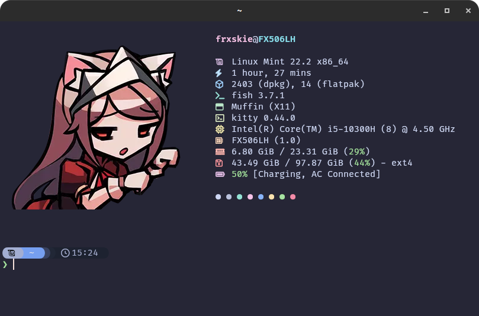

# 🔧 My Dotfiles



My personal configuration for a high-performance Linux development environment.

## 🖼️ Preview
## 🛠️ The Stack
* **OS:** Linux (Debian/Ubuntu based)
* **Terminal:** [Kitty](https://sw.kovidgoyal.net/kitty/) (GPU accelerated)
* **Shell:** [Fish](https://fishshell.com/)
* **Prompt:** [Starship](https://starship.rs/)
* **Font:** FiraCode Nerd Font
* **Package Managers:**
  * Node: `fnm`
  * Python: `uv`
  * Java: `SDKMAN!`

## 🚀 Quick Start (Restoring on a new machine)

### 1. Install System Basics
```bash
sudo apt update
sudo apt install git stow fish curl unzip
````

### 2\. Install the Terminal (Kitty)

*Do not use apt for Kitty.*

```bash
curl -L [https://sw.kovidgoyal.net/kitty/installer.sh](https://sw.kovidgoyal.net/kitty/installer.sh) | sh /dev/stdin
# (Don't forget to add kitty to your PATH or create a .desktop file)
```

### 3\. Install the Tools (The "Power Stack")

Run these commands to set up the languages and prompt:

```bash
# Starship Prompt
curl -sS [https://starship.rs/install.sh](https://starship.rs/install.sh) | sh

# Fast Node Manager (fnm)
curl -fsSL [https://fnm.vercel.app/install](https://fnm.vercel.app/install) | bash

# UV (Python Manager)
curl -LsSf [https://astral.sh/uv/install.sh](https://astral.sh/uv/install.sh) | sh

# SDKMAN! (Java Manager)
curl -s "[https://get.sdkman.io](https://get.sdkman.io)" | bash

# Fastfetch (System Info)
sudo add-apt-repository ppa:zhangsongcui3336/fastfetch
sudo apt update && sudo apt install fastfetch
```

### 4\. Install Fonts

Download and install **FiraCode Nerd Font** (or your preferred Nerd Font) from [nerdfonts.com](https://www.nerdfonts.com/font-downloads).

### 5\. Clone and Stow

Pull this repo and symlink the configs:

```bash
git clone [https://github.com/YOUR_USERNAME/dotfiles.git](https://github.com/YOUR_USERNAME/dotfiles.git) ~/dotfiles
cd ~/dotfiles

# Apply configurations
stow kitty
stow fish
stow starship
stow fastfetch
```

### 6\. Final Setup

Open a new terminal (Fish) and install your languages:

```fish
# Install latest Node LTS
fnm install --lts

# Install Java 21
sdk install java 21.0.2-tem

# Setup Python shell completion
uv generate-shell-completion fish | source
```

````
